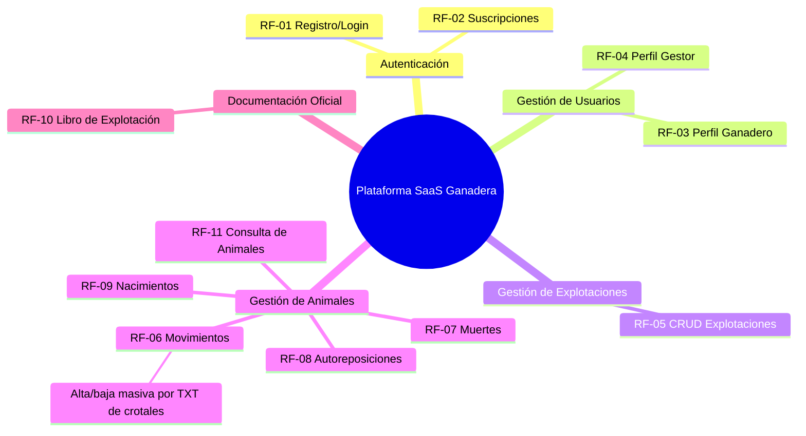
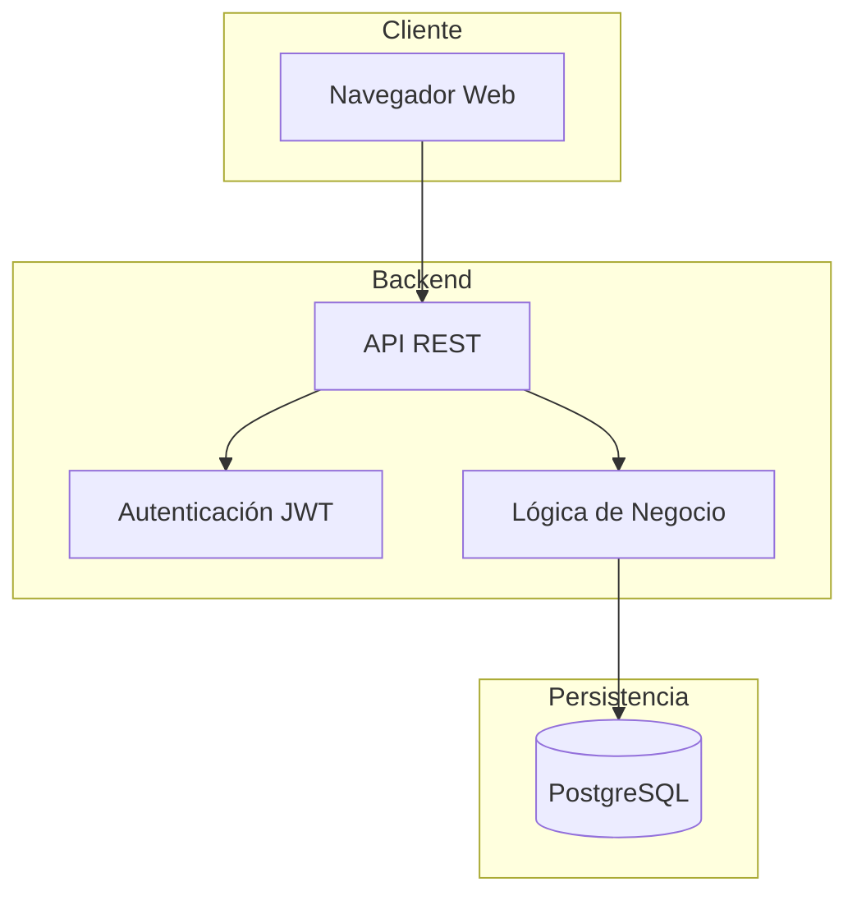

# Product Requirements Document (PRD)
## Plataforma SaaS para la Gestión Digital de Libros de Registro Ganadero

**Versión:** 1.0  
**Autor:** José Manuel García Rosa  
**Fecha:** 2026-04-17  

---

## 1. Visión del Producto

### 1.1 Problema
La trazabilidad y gestión de cabezas de ganado en el sector pecuario español es una actividad rudimentaria realizada mediante:
- Registros en papel
- Herramientas de ofimática poco especializadas
- Aplicaciones de escritorio sin interoperabilidad

Esto genera **ineficiencias, duplicidades y errores** en el manejo de datos, dificultando el cumplimiento normativo y la respuesta ante inspecciones oficiales.

### 1.2 Solución
Una **plataforma SaaS** que permita la **digitalización integral del libro de registro ganadero**, ofreciendo:
- Gestión centralizada de explotaciones, animales y movimientos
- Automatización de procesos administrativos
- Alta y baja masiva de animales mediante archivos TXT generados por lectores de crotales
- Generación estructurada de documentación oficial
- Modelo de suscripción mensual accesible

### 1.3 Hipótesis
> La digitalización del sistema actual de registro ganadero, actualmente gestionado en papel, permitirá optimizar el trabajo tanto de ganaderos como de asesorías mediante la reducción de las cargas administrativas asociadas. Esta transición hacia un sistema digital contribuirá a minimizar los errores derivados de la gestión manual, además de facilitar el acceso a información estructurada, coherente y permanentemente actualizada.

---

## 2. Usuarios Objetivo

### 2.1 Perfiles de Usuario

#### Gestor (Asesoría)
- **Quién:** Asesorías agrícolas y ganaderas, técnicos veterinarios
- **Necesidad:** Administrar múltiples ganaderos y sus explotaciones de forma eficiente
- **Pain points:**
  - Procesos manuales lentos y propensos a errores
  - Dificultad para generar documentación oficial rápidamente
  - Falta de herramientas centralizadas
- **Relación:** Gestiona a uno o más ganaderos (`Manager 1 → 0..* Farmer`)

#### Ganadero (Titular)
- **Quién:** Titulares de explotaciones ganaderas (ovino-caprino y/o porcino)
- **Necesidad:** Mantener al día el libro de registro de sus explotaciones
- **Pain points:**
  - Gestión en papel engorrosa
  - Riesgo de multas por incumplimiento normativo
  - Dificultad ante inspecciones por falta de datos organizados
  - Carga manual elevada al dar de alta o baja muchos animales leídos con crotales
- **Relación:** Posee una o más explotaciones (`Farmer 1 → * Livestock_farm`)

---

## 3. Funcionalidades del Producto

### 3.1 Mapa de Funcionalidades



### 3.2 Detalle de Funcionalidades

#### F1 — Autenticación y Registro (RF-01)
| Aspecto | Detalle |
|---|---|
| **Prioridad** | P0 (Crítica) |
| **Sprint** | Sprint 4 (Iteración 1) |
| **User Story** | Como usuario, quiero registrarme e iniciar sesión para acceder a la plataforma |
| **Criterios de aceptación** | ✅ Registro con email, nombre, apellidos, usuario y contraseña · ✅ Login con credenciales · ✅ Contraseña hasheada · ✅ Gestión de sesión |
| **Entidades** | `User`, `Manager`, `Farmer` |

#### F2 — Gestión de Suscripciones (RF-02)
| Aspecto | Detalle |
|---|---|
| **Prioridad** | P0 (Crítica) |
| **Sprint** | Sprint 4 |
| **User Story** | Como gestor, quiero contratar y gestionar mi plan de suscripción para acceder a las funcionalidades de la plataforma |
| **Criterios de aceptación** | ✅ Selección de plan · ✅ Estado de suscripción visible · ✅ Renovación automática configurable · ✅ Cancelación de suscripción |
| **Entidades** | `Subscription` |

#### F3 — Perfil Ganadero (RF-03)
| Aspecto | Detalle |
|---|---|
| **Prioridad** | P0 |
| **Sprint** | Sprint 4 |
| **User Story** | Como gestor, quiero registrar los datos de mis clientes ganaderos (NIF, domicilio, etc.) para asociarlos a sus explotaciones |
| **Criterios de aceptación** | ✅ CRUD completo de ganaderos · ✅ Datos conforme libro de registro oficial · ✅ Asociación gestor-ganadero |
| **Entidades** | `Farmer` |

#### F4 — Perfil de Gestor (RF-04)
| Aspecto | Detalle |
|---|---|
| **Prioridad** | P0 |
| **Sprint** | Sprint 4 |
| **User Story** | Como gestor, quiero administrar mi perfil y ver todos los ganaderos que gestiono |
| **Criterios de aceptación** | ✅ Edición de datos de perfil · ✅ Listado de ganaderos asociados · ✅ Búsqueda y filtrado |
| **Entidades** | `Manager` |

#### F5 — Gestión de Explotaciones (RF-05)
| Aspecto | Detalle |
|---|---|
| **Prioridad** | P0 |
| **Sprint** | Sprint 4 |
| **User Story** | Como ganadero, quiero registrar y gestionar mis explotaciones ganaderas con todos los datos oficiales |
| **Criterios de aceptación** | ✅ CRUD de explotaciones · ✅ Código REGA · ✅ Clasificación zootécnica · ✅ Estado activa/inactiva · ✅ Coordenadas UTM |
| **Entidades** | `Livestock_farm` |

#### F6 — Registro de Movimientos (RF-06)
| Aspecto | Detalle |
|---|---|
| **Prioridad** | P0 |
| **Sprint** | Sprint 4-5 |
| **User Story** | Como ganadero, quiero registrar guías de movimiento y operaciones masivas de alta/baja de animales para cumplir con la normativa de trazabilidad |
| **Criterios de aceptación** | ✅ Creación de guía con todos los campos oficiales · ✅ Asociación de animales (N:M) · ✅ Origen/destino como explotaciones · ✅ Alta/baja masiva desde TXT con un crotal por línea · ✅ Previsualización de animales válidos, duplicados, ya existentes, no encontrados e inválidos · ✅ Confirmación antes de aplicar cambios · ✅ Impacto automático en balance · ✅ Datos de transporte · ✅ Informe de resultado |
| **Entidades** | `MovementCertificate`, `Animal`, `Balance` |

#### F7 — Registro de Muertes (RF-07)
| Aspecto | Detalle |
|---|---|
| **Prioridad** | P1 |
| **Sprint** | Sprint 5 |
| **User Story** | Como ganadero, quiero registrar la muerte de un animal para actualizar el censo y el balance de la explotación |
| **Criterios de aceptación** | ✅ Baja del animal con causa "M" · ✅ Motivo específico de la baja · ✅ Actualización automática del balance |
| **Entidades** | `Animal`, `Balance` |

#### F8 — Autoreposición (RF-08)
| Aspecto | Detalle |
|---|---|
| **Prioridad** | P1 |
| **Sprint** | Sprint 5 |
| **User Story** | Como ganadero, quiero registrar cambios de categoría de animales dentro de mi explotación |
| **Criterios de aceptación** | ✅ Alta/baja por reposición · ✅ Balance actualizado · ✅ Tipo de animal actualizado (porcino) |
| **Entidades** | `Animal`, `Balance` |

#### F9 — Registro de Nacimientos (RF-09)
| Aspecto | Detalle |
|---|---|
| **Prioridad** | P0 |
| **Sprint** | Sprint 5 |
| **User Story** | Como ganadero, quiero registrar nacimientos en mi explotación para dar de alta nuevas crías |
| **Criterios de aceptación** | ✅ Registro vinculado a madre · ✅ Padre opcional (trazabilidad genética) · ✅ Nº crías, peso, observaciones · ✅ Alta automática de animales con causa "N" · ✅ Balance actualizado |
| **Entidades** | `AnimalBirth`, `Animal`, `Balance` |

#### F10 — Generación del Libro de Explotación (RF-10)
| Aspecto | Detalle |
|---|---|
| **Prioridad** | P0 |
| **Sprint** | Sprint 5 |
| **User Story** | Como ganadero, quiero generar el libro de registro oficial de mi explotación en formato digital para tenerlo disponible ante inspecciones |
| **Criterios de aceptación** | ✅ Portada con datos de titular y explotación · ✅ Hojas de identificación individual · ✅ Hoja de censo total · ✅ Hojas de balance · ✅ Hojas de incidencias · ✅ Hoja de inspecciones · ✅ Exportación PDF |
| **Entidades** | `ExploitationBook`, `Census`, `Balance`, `Incident`, `Inspection` |

#### F11 — Consulta de Animales (RF-11)
| Aspecto | Detalle |
|---|---|
| **Prioridad** | P0 |
| **Sprint** | Sprint 4-5 |
| **User Story** | Como ganadero, quiero consultar la ficha completa de cualquier animal incluyendo vacunaciones, movimientos, nacimientos e incidencias |
| **Criterios de aceptación** | ✅ Búsqueda por nº identificación · ✅ Historial de vacunaciones · ✅ Historial de movimientos · ✅ Datos específicos por especie (ovino/porcino) · ✅ Incidencias asociadas |
| **Entidades** | `Animal`, `OvinoCaprino`, `Porcino`, `Vaccination` |

#### Experiencia clave — Importación TXT de crotales
La aplicación debe incluir, dentro de `F6 — Registro de Movimientos (RF-06)`, un asistente específico para operaciones masivas sobre animales a partir de archivos TXT generados por lectores de crotales. El formato base será un crotal por línea. El flujo debe permitir seleccionar explotación, elegir operación (alta masiva o baja masiva), subir el archivo, previsualizar resultados, resolver errores y confirmar la operación.

Estados esperados en la previsualización:
- **Válido:** identificación lista para procesar.
- **Duplicado:** identificación repetida dentro del TXT.
- **Ya existente:** identificación ya registrada cuando se intenta un alta.
- **No encontrado:** identificación inexistente cuando se intenta una baja.
- **Formato inválido:** línea que no cumple el patrón esperado.

El resultado final debe mostrar animales procesados, animales rechazados, balance actualizado y opción de descargar un informe.

---

## 4. Modelo de Datos

El modelo de datos completo se documenta en `diagrama_entidades.md` con **20 entidades** organizadas en las siguientes jerarquías:

### 4.1 Jerarquía de Usuarios
```
User (abstracta)
├── Manager
└── Farmer
```

### 4.2 Jerarquía de Animales
```
Animal (abstracta)
├── OvinoCaprino
└── Porcino
```

### 4.3 Jerarquía de Censos
```
Census (abstracta)
├── CensusOvinoCaprino
└── CensusPorcino
```

### 4.4 Jerarquía de Balances
```
Balance (abstracta)
├── BalanceOvinoCaprino
└── BalancePorcino
```

### 4.5 Entidades Independientes
- `Subscription` — Gestión de suscripciones
- `Livestock_farm` — Explotaciones ganaderas
- `ExploitationBook` — Libro de registro oficial
- `AnimalBirth` — Nacimientos
- `Vaccination` — Vacunaciones
- `MovementCertificate` — Guías de movimiento
- `Incident` — Incidencias de identificación
- `Inspection` — Control de inspecciones

---

## 5. Planificación

### 5.1 Sprints de Desarrollo

| Sprint | Periodo | Foco |
|---|---|---|
| **Sprint 4** | 21/03 – 15/04/2026 | Backend: estructura, entidades del dominio, CRUD, autenticación |
| **Sprint 5** | 16/04 – 05/05/2026 | Funcionalidades restantes, integración, validaciones, seguridad |
| **Sprint 6** | 06/05 – 18/05/2026 | Pruebas finales, correcciones, documentación |

### 5.2 Iteraciones de Implementación

| Iteración | Sprint | Funcionalidades |
|---|---|---|
| **Iteración 1 (MVP)** | Sprint 4 | RF-01, RF-02, RF-03, RF-04, RF-05, RF-11 (consulta básica) |
| **Iteración 2** | Sprint 4-5 | RF-06, RF-07, RF-08, RF-09 |
| **Iteración 3** | Sprint 5 | RF-10, RF-11 (completo) |

---

## 6. Arquitectura de Alto Nivel

### 6.1 Arquitectura SaaS



### 6.2 Stack Tecnológico

| Capa | Tecnología | Observaciones |
|---|---|---|
| **Frontend** | Por definir | React / Angular / Vue |
| **Backend** | Por definir | Spring Boot / Node.js |
| **Base de datos** | PostgreSQL | Modelo relacional normalizado |
| **Autenticación** | JWT / OAuth2 | Tokens de sesión |
| **Testing Backend** | JUnit / Jest | Cobertura ≥ 80% |
| **CI/CD** | GitHub Actions | Automatización |
| **Contenedores** | Docker | Despliegue |

---

## 7. Métricas de Éxito

| Métrica | Objetivo |
|---|---|
| **Cobertura de tests** | ≥ 80% en backend |
| **Tiempo de respuesta** | < 2s para consultas |
| **Generación de libro** | < 10s para exportación PDF |
| **Importación TXT** | Previsualización clara de hasta 1.000 crotales y resumen de errores antes de confirmar |
| **Disponibilidad** | 99.5% uptime |
| **Requisitos cubiertos** | 11/11 RF implementados |

---

## 8. Riesgos

| ID | Riesgo | Probabilidad | Impacto | Mitigación |
|---|---|---|---|---|
| RG-01 | Definición incorrecta de requisitos | Media | Alto | Auditorías de trazabilidad RF ↔ Entidades |
| RG-02 | Cambio en normativa ganadera | Media | Alto | Diseño modular y extensible |
| RG-03 | Dificultad técnica en desarrollo | Media | Medio | Evaluación de alternativas tecnológicas |
| RG-04 | Retraso en planificación | Alta | Alto | Priorización de funcionalidades clave (MVP) |
| RG-05 | Errores en archivos TXT de lectores de crotales | Media | Alto | Validación previa, previsualización y generación de informe de errores |
| RG-07 | No cumplir fecha de entrega | Media | Alto | MVP funcional + incrementos posteriores |

---

## 9. Líneas Futuras

- Integración con sistemas oficiales de la administración pública (SITRAN, Oficina Veterinaria Virtual)
- Módulos de análisis de datos para apoyo a la toma de decisiones
- Aplicación móvil nativa
- Soporte para nuevas especies ganaderas
- Notificaciones y alertas automáticas (vacunaciones, vencimientos, inspecciones)
