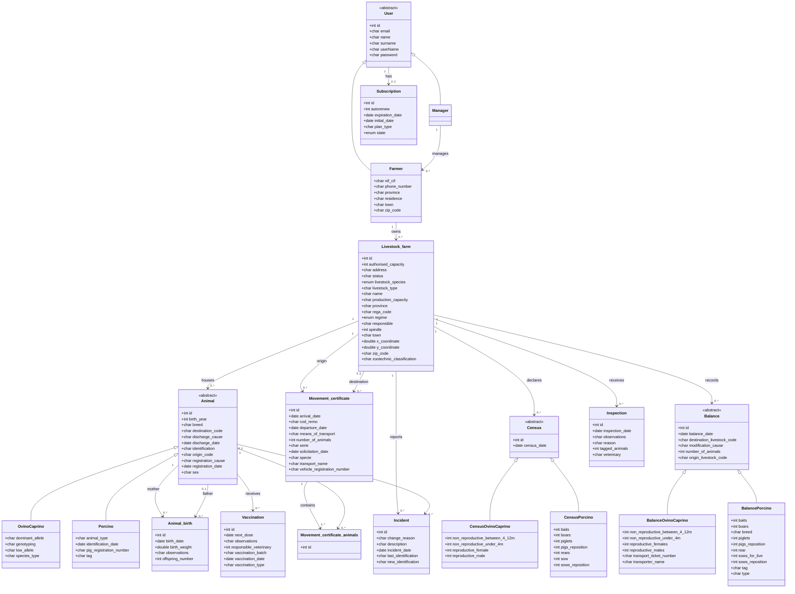

# Diagrama de Entidades - Aplicacion de Gestion Ganadera

Este documento describe la version actual del modelo de entidades representada en `info/SR Diagram-4.bmp` y su traduccion inicial a PostgreSQL.

## Convenciones

- Las claves foraneas se infieren por las asociaciones del diagrama. En el modelo fisico SQL se materializan como columnas `*_id`.
- Las clases base con herencia se implementan con una tabla base y una tabla por subtipo:
  - `app_user` + `manager` / `farmer`
  - `animal` + `ovino_caprino` / `porcino`
  - `census` + `census_ovino_caprino` / `census_porcino`
  - `balance` + `balance_ovino_caprino` / `balance_porcino`
- `ExploitationBook` no se modela como entidad persistente. La generacion del libro de explotacion se considera una funcionalidad de exportacion PDF/CSV construida desde los datos persistidos. Si en el futuro se necesita auditoria o versionado de exportaciones, se podra anadir una tabla especifica de exportaciones generadas.
- Los codigos administrativos, identificadores oficiales, telefonos, codigos postales y codigos REGA se guardan como texto para preservar letras, separadores y ceros iniciales.
- Una explotacion solo puede tener una especie ganadera principal. Por ello `census_ovino_caprino` no separa ovino y caprino en columnas distintas.

## Diagrama de Clases



## Entidades Persistidas

### `app_user`

Usuario base del sistema. Se usa `app_user` en PostgreSQL para evitar conflictos con palabras reservadas o nombres habituales del motor.

| Campo | Tipo SQL | Notas |
|---|---|---|
| `id` | `BIGINT IDENTITY` | PK |
| `email` | `VARCHAR(255)` | Unico |
| `name` | `VARCHAR(120)` | Nombre |
| `surname` | `VARCHAR(180)` | Apellidos |
| `username` | `VARCHAR(120)` | Unico |
| `password_hash` | `TEXT` | Hash de contrasena |

### `manager`

Subtipo de usuario gestor.

| Campo | Tipo SQL | Notas |
|---|---|---|
| `user_id` | `BIGINT` | PK y FK a `app_user` |

### `farmer`

Subtipo de usuario ganadero.

| Campo | Tipo SQL | Notas |
|---|---|---|
| `user_id` | `BIGINT` | PK y FK a `app_user` |
| `manager_id` | `BIGINT` | FK nullable a `manager` |
| `nif_cif` | `VARCHAR(32)` | Unico |
| `phone_number` | `VARCHAR(32)` | Texto para prefijos y separadores |
| `province` | `VARCHAR(120)` | Provincia |
| `residence` | `VARCHAR(255)` | Domicilio |
| `town` | `VARCHAR(120)` | Localidad |
| `zip_code` | `VARCHAR(16)` | Texto para preservar ceros iniciales |

### `subscription`

Suscripcion de un usuario.

| Campo | Tipo SQL | Notas |
|---|---|---|
| `id` | `BIGINT IDENTITY` | PK |
| `user_id` | `BIGINT` | FK unica a `app_user` |
| `autorenew` | `BOOLEAN` | Renovacion automatica |
| `expiration_date` | `DATE` | Fin de suscripcion |
| `initial_date` | `DATE` | Inicio de suscripcion |
| `plan_type` | `VARCHAR(60)` | Tipo de plan |
| `state` | `VARCHAR(40)` | Estado |

### `livestock_farm`

Explotacion ganadera.

| Campo | Tipo SQL | Notas |
|---|---|---|
| `id` | `BIGINT IDENTITY` | PK |
| `farmer_id` | `BIGINT` | FK a `farmer` |
| `authorised_capacity` | `INTEGER` | Capacidad autorizada |
| `address` | `VARCHAR(255)` | Direccion |
| `status` | `VARCHAR(40)` | Estado |
| `livestock_species` | `VARCHAR(40)` | `ovine`, `caprine` o `porcine` |
| `livestock_type` | `VARCHAR(80)` | Tipo de explotacion |
| `name` | `VARCHAR(160)` | Nombre |
| `production_capacity` | `VARCHAR(120)` | Clasificacion/capacidad productiva |
| `province` | `VARCHAR(120)` | Provincia |
| `rega_code` | `VARCHAR(32)` | Codigo REGA unico |
| `regime` | `VARCHAR(80)` | Regimen |
| `responsible` | `VARCHAR(180)` | Responsable |
| `spindle` | `INTEGER` | Huso |
| `town` | `VARCHAR(120)` | Localidad |
| `x_coordinate` | `DOUBLE PRECISION` | Coordenada X |
| `y_coordinate` | `DOUBLE PRECISION` | Coordenada Y |
| `zip_code` | `VARCHAR(16)` | Codigo postal |
| `zootechnic_classification` | `VARCHAR(120)` | Clasificacion zootecnica |

### `animal`

Animal base identificado.

| Campo | Tipo SQL | Notas |
|---|---|---|
| `id` | `BIGINT IDENTITY` | PK |
| `livestock_farm_id` | `BIGINT` | FK a `livestock_farm` |
| `birth_year` | `INTEGER` | Ano de nacimiento |
| `breed` | `VARCHAR(80)` | Raza |
| `destination_code` | `VARCHAR(32)` | Codigo destino |
| `discharge_cause` | `VARCHAR(80)` | Causa de baja |
| `discharge_date` | `DATE` | Fecha de baja |
| `identification` | `VARCHAR(80)` | Identificacion oficial unica |
| `origin_code` | `VARCHAR(32)` | Codigo origen |
| `registration_cause` | `VARCHAR(80)` | Causa de alta |
| `registration_date` | `DATE` | Fecha de alta |
| `sex` | `VARCHAR(20)` | Sexo |

### `ovino_caprino`

Datos especificos de animales ovinos o caprinos.

| Campo | Tipo SQL | Notas |
|---|---|---|
| `animal_id` | `BIGINT` | PK y FK a `animal` |
| `dominant_allele` | `VARCHAR(80)` | Alelo dominante |
| `genotyping` | `VARCHAR(120)` | Genotipado |
| `low_allele` | `VARCHAR(80)` | Alelo bajo |
| `species_type` | `VARCHAR(40)` | `ovine` o `caprine` |

### `porcino`

Datos especificos de animales porcinos.

| Campo | Tipo SQL | Notas |
|---|---|---|
| `animal_id` | `BIGINT` | PK y FK a `animal` |
| `animal_type` | `VARCHAR(80)` | Tipo de animal |
| `identification_date` | `DATE` | Fecha de identificacion |
| `pig_registration_number` | `VARCHAR(80)` | Registro porcino |
| `tag` | `VARCHAR(80)` | Marca/crotal |

### `animal_birth`

Registro de nacimientos.

| Campo | Tipo SQL | Notas |
|---|---|---|
| `id` | `BIGINT IDENTITY` | PK |
| `mother_animal_id` | `BIGINT` | FK a `animal` |
| `father_animal_id` | `BIGINT` | FK nullable a `animal` |
| `birth_date` | `DATE` | Fecha de nacimiento |
| `birth_weight` | `NUMERIC(8,3)` | Peso al nacimiento |
| `observations` | `TEXT` | Observaciones |
| `offspring_number` | `INTEGER` | Numero de crias |

### `vaccination`

Vacunaciones de animales.

| Campo | Tipo SQL | Notas |
|---|---|---|
| `id` | `BIGINT IDENTITY` | PK |
| `animal_id` | `BIGINT` | FK a `animal` |
| `next_dose` | `DATE` | Proxima dosis |
| `observations` | `TEXT` | Observaciones |
| `responsible_veterinary` | `BIGINT` | Identificador del veterinario si aplica |
| `vaccination_batch` | `VARCHAR(120)` | Lote |
| `vaccination_date` | `DATE` | Fecha |
| `vaccination_type` | `VARCHAR(120)` | Tipo |

### `movement_certificate`

Certificado o guia de movimiento.

| Campo | Tipo SQL | Notas |
|---|---|---|
| `id` | `BIGINT IDENTITY` | PK |
| `origin_livestock_id` | `BIGINT` | FK a `livestock_farm` |
| `destination_livestock_id` | `BIGINT` | FK nullable a `livestock_farm` |
| `arrival_date` | `DATE` | Fecha de llegada |
| `cod_remo` | `VARCHAR(80)` | Codigo REMO |
| `departure_date` | `DATE` | Fecha de salida |
| `means_of_transport` | `VARCHAR(120)` | Medio de transporte |
| `number_of_animals` | `INTEGER` | Numero declarado en la guia |
| `serie` | `VARCHAR(80)` | Serie |
| `solicitation_date` | `DATE` | Fecha de solicitud |
| `specie` | `VARCHAR(40)` | Especie |
| `transport_name` | `VARCHAR(180)` | Transportista |
| `vehicle_registration_number` | `VARCHAR(40)` | Matricula |

### `movement_certificate_animals`

Tabla puente entre guias de movimiento y animales.

| Campo | Tipo SQL | Notas |
|---|---|---|
| `id` | `BIGINT IDENTITY` | PK |
| `movement_certificate_id` | `BIGINT` | FK a `movement_certificate` |
| `animal_id` | `BIGINT` | FK a `animal` |

Existe una restriccion unica sobre `(movement_certificate_id, animal_id)` para evitar duplicar el mismo animal dentro de una misma guia.

### `census`, `census_ovino_caprino`, `census_porcino`

Registro de censos por explotacion y subtipo.

| Tabla | Proposito |
|---|---|
| `census` | Cabecera comun con explotacion y fecha |
| `census_ovino_caprino` | Censo para explotaciones ovinas o caprinas |
| `census_porcino` | Censo para explotaciones porcinas |

### `balance`, `balance_ovino_caprino`, `balance_porcino`

Registro de balances y movimientos de censo por explotacion y subtipo.

| Tabla | Proposito |
|---|---|
| `balance` | Cabecera comun del balance |
| `balance_ovino_caprino` | Detalle de balance ovino/caprino |
| `balance_porcino` | Detalle de balance porcino |

### `incident`

Incidencias de identificacion o registro.

| Campo | Tipo SQL | Notas |
|---|---|---|
| `id` | `BIGINT IDENTITY` | PK |
| `livestock_farm_id` | `BIGINT` | FK a `livestock_farm` |
| `animal_id` | `BIGINT` | FK nullable a `animal` |
| `change_reason` | `VARCHAR(120)` | Motivo |
| `description` | `TEXT` | Descripcion |
| `incident_date` | `DATE` | Fecha |
| `last_identification` | `VARCHAR(80)` | Identificacion anterior |
| `new_identification` | `VARCHAR(80)` | Nueva identificacion |

### `inspection`

Inspecciones recibidas por una explotacion.

| Campo | Tipo SQL | Notas |
|---|---|---|
| `id` | `BIGINT IDENTITY` | PK |
| `livestock_farm_id` | `BIGINT` | FK a `livestock_farm` |
| `inspection_date` | `DATE` | Fecha |
| `observations` | `TEXT` | Observaciones |
| `reason` | `VARCHAR(120)` | Motivo |
| `tagged_animals` | `INTEGER` | Numero de animales marcados |
| `veterinary` | `VARCHAR(180)` | Veterinario |

## Despliegue Local

La base de datos se despliega con Docker Compose:

```bash
docker compose up -d
```

Datos de conexion por defecto:

| Parametro | Valor |
|---|---|
| Host | `localhost` |
| Puerto | `55432` |
| Base de datos | `livestock` |
| Usuario | `livestock` |
| Password | `livestock_dev_password` |

El volumen persistente se llama `livestock_postgres_data`. Los scripts de `db/init` se ejecutan automaticamente solo cuando PostgreSQL inicializa un volumen vacio.
